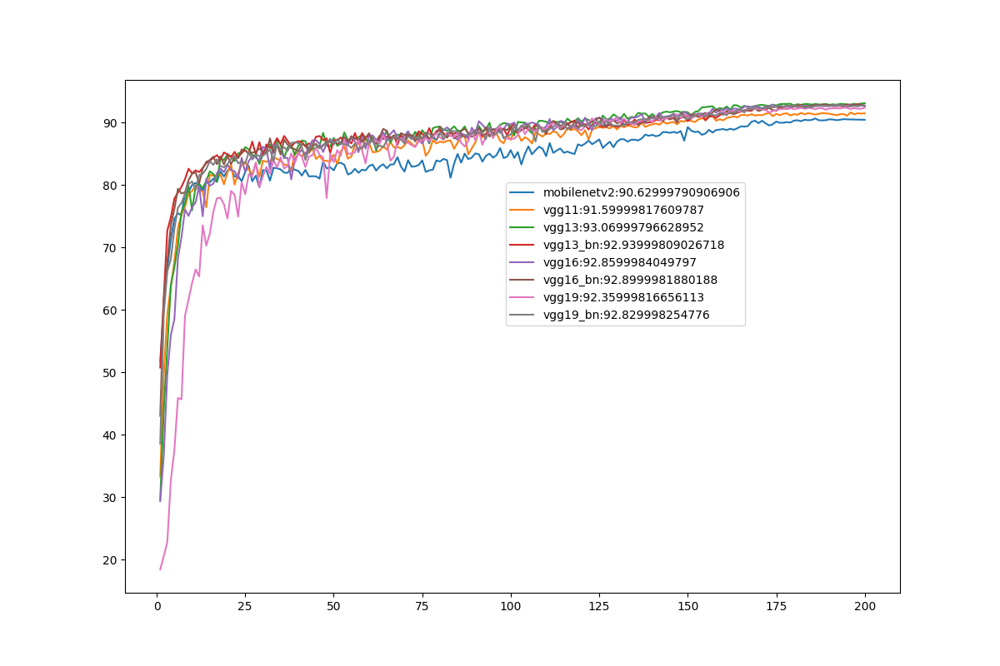

# ToyCIFAR10

## Installation

```bash
conda create -n toycifar python=3.7
conda activate toycifar

# make sure that the pytorch cuda is consistent with the system cuda
# e.g., if your system cuda is 10.0, install torch 1.4 built from cuda 10.0
pip install torch==1.4.0+cu100 -f https://download.pytorch.org/whl/torch_stable.html

pip install -r requirements.txt
export PYTHONPATH = /path/to/ToyCIFAR10/
```

## Quick Start

1. Train

```bash
# start training a new network(vgg11 here)

python main.py --model vgg11
# resume training with pretrained model(vgg11 here)
python main.py --resume --model vgg11
# train with data augmentation
python main.py --noise random --type train --model vgg11
```

VGG-13 pretrained model is saved in `outputs/vgg13/default`

2. Test

```bash
# test best pretrained model(vgg11 here)
python main.py --type test --model vgg11
# test with noise (random/gauss/sp/...)
python main.py --type test --model vgg11 --noise gauss
```

## Training Details

### Learning Rate
Initial learning rate = 0.05, lr=0.01 is also recommended here.
Cosineannealing strategy, T_max = total epochs.

## Accuracy

| Accuracy rate(%) \<br />num of epochs |  20   |  40   |  60   |  80   |  100  |  120  |  140  |  160  |  180  |  200  | Best  |
| :-----------------------------------: | :---: | :---: | :---: | :---: | :---: | :---: | :---: | :---: | :---: | :---: | ----- |
|             Mobilenetv2               | 82.28 | 82.24 | 83.04 | 83.74 | 85.57 | 86.26 | 88.01 | 88.94 | 90.29 | 90.42 | 90.63 |
|                VGG-11                 | 82.03 | 84.96 | 86.65 | 86.93 | 87.21 | 87.94 | 89.69 | 90.33 | 91.33 | 91.44 | 91.60 |
|                VGG-13                 | 84.86 | 86.28 | 86.88 | 89.33 | 88.97 | 90.12 | 91.35 | 92.15 | 92.72 | 93.07 | 93.07 |
|                VGG-16                 | 83.22 | 85.00 | 87.87 | 88.22 | 89.65 | 89.55 | 90.62 | 91.92 | 92.76 | 92.64 | 92.86 |
|                VGG-19                 | 74.61 | 85.07 | 86.77 | 87.60 | 87.37 | 88.77 | 90.10 | 91.71 | 92.13 | 92.36 | 92.36 |
|         VGG-13 (Batch norm)           | 84.89 | 86.99 | 87.95 | 88.74 | 89.21 | 89.86 | 90.06 | 91.50 | 92.65 | 92.63 | 92.94 |
|         VGG-16 (Batch norm)           | 84.61 | 85.35 | 88.26 | 89.31 | 89.46 | 89.39 | 90.93 | 91.21 | 92.58 | 92.70 | 92.90 |
|         VGG-19 (Batch norm)           | 83.33 | 86.69 | 86.49 | 88.42 | 88.02 | 89.56 | 90.97 | 91.42 | 92.68 | 92.65 | 92.83 |


